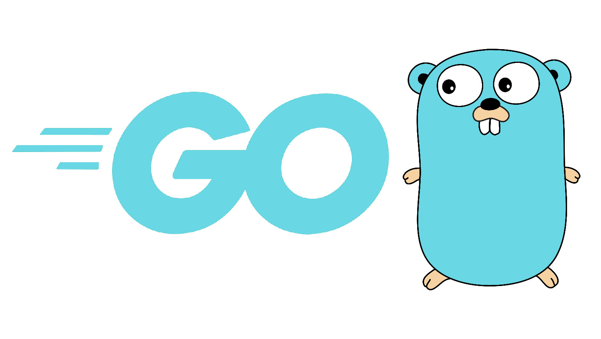
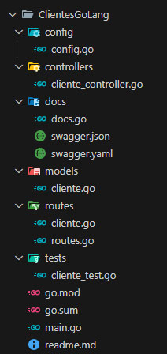
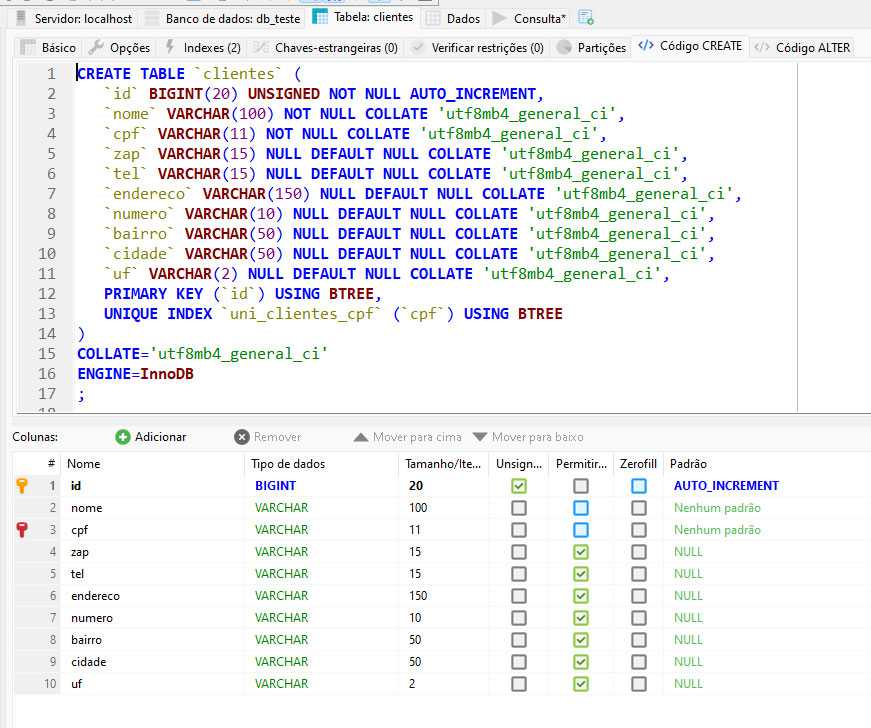
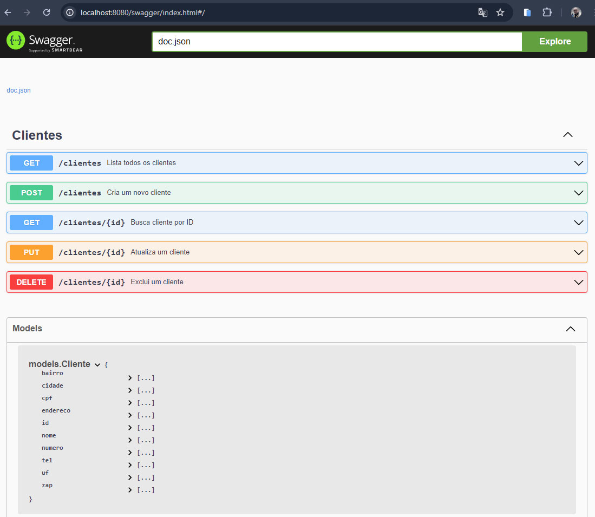

<p align="center">
  
</p>

# Objetivo e detalhes do Projeto
```bash
Criar um Backend em Go para acessar as principais operações da tabela Clientes do banco mysql
```

## Table:
```bash
CREATE TABLE `clientes` (
	`id` BIGINT(20) UNSIGNED NOT NULL AUTO_INCREMENT,
	`nome` VARCHAR(100) NOT NULL COLLATE 'utf8mb4_general_ci',
	`cpf` VARCHAR(11) NOT NULL COLLATE 'utf8mb4_general_ci',
	`zap` VARCHAR(15) NULL DEFAULT NULL COLLATE 'utf8mb4_general_ci',
	`tel` VARCHAR(15) NULL DEFAULT NULL COLLATE 'utf8mb4_general_ci',
	`endereco` VARCHAR(150) NULL DEFAULT NULL COLLATE 'utf8mb4_general_ci',
	`numero` VARCHAR(10) NULL DEFAULT NULL COLLATE 'utf8mb4_general_ci',
	`bairro` VARCHAR(50) NULL DEFAULT NULL COLLATE 'utf8mb4_general_ci',
	`cidade` VARCHAR(50) NULL DEFAULT NULL COLLATE 'utf8mb4_general_ci',
	`uf` VARCHAR(2) NULL DEFAULT NULL COLLATE 'utf8mb4_general_ci',
	PRIMARY KEY (`id`) USING BTREE,
	UNIQUE INDEX `uni_clientes_cpf` (`cpf`) USING BTREE
)
COLLATE='utf8mb4_general_ci'
ENGINE=InnoDB
;
```

## Criando o projeto
go mod init go-backend

## Dependencias necessárias
```bash
go get -u gorm.io/gorm
go get -u gorm.io/driver/mysql
go get -u github.com/gorilla/mux
```

## Incluindo o swagger
```bash
go install github.com/swaggo/swag/cmd/swag@latest
go get -u github.com/swaggo/gin-swagger
go get -u github.com/swaggo/files
```

## Adicionando o swagger
swag init

## Instalação de teste automatizado
```bash
go get github.com/stretchr/testify
go get github.com/gin-gonic/gin
```

## Testes
go test ./tests

## Executando 
go run main.go

## Detalhes
## Estrutura


## Tabela


## Documentação - Swagger


## suporte
```bash
WhatsApp: (85) 9 9150-8104
Mail: geraldo@gpsoft.com.br
```
